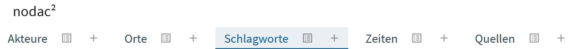
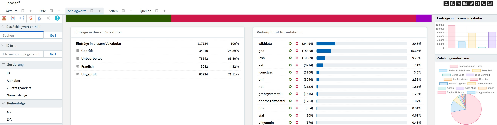

# nodac: Schlagworte

Auf dieser Seite finden sich Hinweise zur Verwaltung, Bearbeitung und Anreicherung von Informationen zu Schlagworten mit dem nodac-Werkzeug. Am unteren Seitenende ist ein entsprechendes Video eingebunden.

Unterhalb des Hauptmenus von nodac findet sich eine Leiste mit der Möglichkeit ein zu bearbeitendes Vokabular auszuwählen. Es erscheinen hier nur die Vokabulare für welche der aktuelle Bearbeiter freigeschaltet ist. Ist ein Vokabular ausgewählt, so wird der entsprechende Bereich farbig hervorgehoben. Hinter dem Namen des Vokabulars erscheinen zwei Symbole. Für jedes Vokabular gibt es damit drei Möglichkeiten des Einstiegs:

- Klick auf den Namen des Vokabulars führt zur Startseite desselben.
- Klick auf das Listensymbol hinter dem Namen des Vokabulars führt zu einer Auflistung aller Einträge.
- Klick auf das Pluszeichen ermöglicht ein Schlagwort zu erfassen.

## Startseite
Die Startseite von nodac: Schlagworte ist mehrspaltig konzipiert. In der linken Spalte findet sich die spezifische Navigation mit Such- und Eingrenzungsmöglichkeiten, im zentralen Bereich Kacheln die den Stand der Bearbeitung veranschaulichen, aber auch als Schnellzugriff konzipiert sind. Die rechte Spalte zeigt Visualisierungen des Bearbeitungsstandes.

### Schlagworte: Navigation
Die Navigationsspalte von nodac: Schlagworte wird auf der Startseite und bei den Trefferlisten angezeigt. Bei der Einzelbearbeitung ist sie ausgeblendet.

Das Symbolmenu am oberen Rand der Navigationsspalte enthält folgende Schalter:

- Die Pagode führt zur Startseite von nodac: Schlagworte. Sie hat damit die gleiche Funktion wie ein Anklicken von "Schlagworte" im Auswahlmenu für die Vokabulare.
- Der Schalter, welcher Personen mit rotem Verbindungspfeil zeigt führt zu einer Suche nach Dublikaten. Es wird nach Schlagworten gleicher Benennung gesucht.
- Die "liegende Stimmgabel" führt zu einer Suche nach mehrfach gespeicherten Beziehungen.
- Der "schrägstehende Hufeisenmagnet" führt zu einer Suche nach hierarchischen Beziehungen erster Generation, d.h. Begriffen, die sich selbst unter- oder übergeordnet sind.
- Der "Mann mit dem Krückstock" führt zu einer Suche nach hierarchischen Beziehungen zweiter Generation, d.h. ein Begriff ist einem anderen Begriff über- oder untergeordnet und zugleich dessen über- oder untergeordneter Begriff.
- Das "x" zeigt die Blacklist, eine Liste von Begriffen, welche das System ignoriert. Im Falle von museum-digital sind das vor allem nicht individualisierbare Entitäten. Wird nodac: Akteure für ein externes Akteurverzeichnis verwendet, dann können andere Regeln gelten.
Seite wird vervollständigt.

## YouTube-Video zu Schlagworten in nodac

<b>Anleitung auf Youtube</b> 
Mit einem Klick wird das Video geladen. Damit werden andererseits ihre Daten mit Youtube geteilt.

